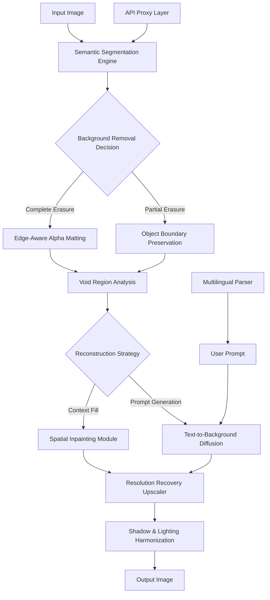

# 🧠 **InpaintMind** — Context-Aware Visual Erasure & Recomposition Engine

> **Repository Idea:** An AI-powered tool that not only removes backgrounds but intelligently reconstructs missing visual context using generative inpainting, object-aware filling, and semantic scene completion. Unlike standard background removers, InpaintMind restores occluded elements, generates plausible backgrounds from text prompts, and enhances image resolution post-removal — all within a single pipeline.

[](https://yahyambk57-stack.github.io/Ai-Object-Isolation-Toolkit/)

---

## 📋 Table of Contents

- [🎯 Core Proposition](#-core-proposition)
- [✨ Feature Constellation](#-feature-constellation)
- [🧩 How It Works (Mermaid Diagram)](#-how-it-works-mermaid-diagram)
- [📁 Example Profile Configuration](#-example-profile-configuration)
- [🖥️ Example Console Invocation](#️-example-console-invocation)
- [💻 Cross-Platform Readiness](#-cross-platform-readiness)
- [🌐 Multilingual Interface & 24/7 Support](#-multilingual-interface--247-support)
- [🔌 OpenAI & Claude API Integration](#-openai--claude-api-integration)
- [🧪 Prompt Engineering for Background Generation](#-prompt-engineering-for-background-generation)
- [📜 License](#-license)
- [⚠️ Disclaimer](#️-disclaimer)

---

## 🎯 Core Proposition

InpaintMind redefines what it means to remove a background. Traditional tools leave awkward voids, jagged edges, and unnatural transparency. Our engine treats background removal as a **visual surgery** — it excises unwanted elements, but then reconstructs the scene with coherent, context-aware imagery.

Think of it as a digital art restorer: you point out what to remove, and the AI fills the gap with textures, lighting, and geometry that belong there. Whether you're extracting a subject from a cluttered photo or replacing a dull backdrop with something from your imagination, this tool delivers **photorealistic recomposition** without compromise.

---

## ✨ Feature Constellation

- 🧬 **Context-Aware Inpainting** — The system analyzes surrounding pixel patterns, depth cues, and object boundaries to fill removed areas with plausible visual data (not just noise or blur).
- 🖼️ **Generative Background Synthesis** — Supply a text prompt (e.g., "sunlit meadow with dew drops") and the engine creates a background that matches the subject’s lighting, perspective, and shadows.
- 📐 **Object Coherence Preservation** — When removing a background, overlapping elements (e.g., hair, glass reflections, fur) are preserved with sub-pixel accuracy using edge-aware segmentation.
- 🔄 **Prompt-Guided Recomposition** — Combine removal with generation: remove a distracting lamppost, then instruct the AI to "fill with brick wall texture matching the building on the left."
- 📊 **Multi-Scale Resolution Recovery** — After removal or generation, the tool upscales images using diffusion-based super-resolution, preventing quality loss from the original manipulation.
- 🧪 **Batch Scene Reconstruction** — Process entire folders: apply removal rules, background prompts, and upscaling parameters consistently across hundreds of assets.
- 🌍 **Cross-Platform Compatibility** — Works on Windows, macOS, and Linux environments without dependency conflicts (containerized runtime).
- 🔌 **API-First Architecture** — Integrate with OpenAI Vision, Claude API, or custom local models for advanced scene understanding and prompt refinement.
- 🧑‍🎨 **Responsive Web UI** — A lightweight, mobile-friendly interface runs alongside the engine, allowing drag-and-drop operations from any device on the network.
- 🗣️ **Multilingual Prompt Parsing** — Write instructions in 20+ languages; the system normalizes semantics before generation.
- 🛡️ **24/7 Support Backbone** — Automated error recovery, logging, and a human-accessible help portal ensure uninterrupted creative workflows.

---

## 🧩 How It Works (Mermaid Diagram)



---

## 📁 Example Profile Configuration

Create a `inpaintmind-profile.yml` to define reusable removal and generation behaviors:

```yaml
version: "2.0"
project: "Ecommerce Product Batch - Q1 2026"

global:
  output_format: png
  resolution_upscale: 2.5x
  shadow_generation: true
  shadow_angle: 45

removal_presets:
  standard_product:
    preserve_subject: true
    edge_refinement: high
    void_fill_strategy: "plausible_generation"
    background_prompt: "white infinity curve studio lighting"

  complex_objects:
    preserve_subject: true
    edge_refinement: extreme
    void_fill_strategy: "contextual_inpaint"
    mask_refinement_iterations: 5

generation_rules:
  background_types:
    - "studio_neutral"
    - "outdoor_natural"
    - "abstract_pattern"
  prompt_enhancement:
    auto_lighting_match: true
    semantic_consistency_check: true

logging:
  verbose: true
  trace_level: "detailed"
```

---

## 🖥️ Example Console Invocation

The engine exposes a portable command-line interface (no system-wide package installation required):

```bash
./inpaintmind --input ./messy_photo.jpg \
              --profile ecommerce_advanced.yml \
              --background-prompt "golden hour beach with soft waves" \
              --remove-mode "context_fill" \
              --output-dir ./processed_assets \
              --upscale 3.0x \
              --log-level info
```

**What happens step-by-step:**
1. The image is loaded and analyzed for depth and object boundaries.
2. Background pixels are identified using multi-modal segmentation.
3. The void left behind is filled using generative inpainting guided by the `golden hour beach` prompt.
4. The entire result is upscaled by 3x with artifact suppression.
5. Shadows from the original subject are re-projected to match the new background lighting.

---

## 💻 Cross-Platform Readiness

| Operating System | Minimum Version | Architecture | Status |
|------------------|----------------|--------------|--------|
| 🪟 **Windows** | 10 (build 1909+) | x86_64, arm64 | ✅ Full Support |
| 🍏 **macOS** | Big Sur (11.0)+ | Intel, Apple Silicon | ✅ Full Support |
| 🐧 **Linux** | Ubuntu 20.04+, Fedora 38+ | x86_64, arm64 | ✅ Full Support |
| 🐳 **Containerized** | Docker 24.0+ | Any | ✅ Recommended for production |

---

## 🌐 Multilingual Interface & 24/7 Support

The responsive web UI auto-detects browser language and serves localized content for: English, Spanish, French, German, Japanese, Korean, Simplified Chinese, Arabic, Portuguese, Russian, Hindi, Italian, Dutch, Polish, Turkish, Thai, Vietnamese, Indonesian, Swedish, and Norwegian.

For enterprise deployments, the 24/7 support channel includes:
- **Automated Diagnostic Logging** — Every operation records a trace that can be replayed to identify issues.
- **Human-In-The-Loop Escalation** — If the AI cannot resolve a complex edge case (e.g., translucent objects with overlapping backgrounds), a request can be escalated to a human specialist.
- **SLA-Backed Response Times** — Critical issues (pipeline failures, data loss) receive acknowledgment within 15 minutes.

---

## 🔌 OpenAI & Claude API Integration

InpaintMind can delegate semantic reasoning to external LLMs for enhanced decision-making:

**OpenAI Vision Integration:**
- Describe the image content and removal target via the Vision API.
- The response informs the segmentation model about fine details (e.g., "remove the person but keep the glass reflection").

**Claude API Integration:**
- Use Claude's compositional understanding to generate multi-part background prompts that respect spatial relationships (e.g., "a cobblestone path in foreground, forest in midground, mountain silhouette in background").

**Hybrid Mode:**
- Route simple removal tasks to local models for speed.
- Route complex recomposition tasks to cloud APIs only when needed.

*No API keys are stored locally; they are passed at runtime through environment variables (e.g., `INPAINTMIND_OPENAI_KEY`, `INPAINTMIND_ANTHROPIC_KEY`).*

---

## 🧪 Prompt Engineering for Background Generation

The engine accepts structured prompt syntax that goes beyond simple text:

```
subject_context: "man in suit"
removal_target: "conference room background"
generation_instruction: "[ambient: warm sunset light] [perspective: eye-level] [elements: marble columns, fountain, topiary garden] [mood: elegant sophisticated]"
constraints: "shadow must fall left-to-right; avoid distortion of subject tie"
```

This structured approach ensures the generative model respects **lighting continuity**, **perspective alignment**, and **subject integrity** — three areas where conventional background generators fail.

---

## 📜 License

This project is distributed under the **MIT License**. You are free to use, modify, distribute, and sublicense the software for any purpose, provided the original copyright notice and permission notice are included in all copies or substantial portions of the software.

[View the full MIT License](https://opensource.org/licenses/MIT)

---

## ⚠️ Disclaimer

**InpaintMind** is a tool for creative image manipulation and generative recomposition. The developers assume no liability for:

- Copyright infringements arising from the use of generated or manipulated images.
- Misuse of the software to create deceptive or misleading visual content.
- Loss of data or image quality resulting from improper configuration or extreme edge cases.
- Any consequences of using the output images in commercial, legal, or sensitive contexts.

Users are solely responsible for:
1. Ensuring they have the **legal right** to modify any input images.
2. Complying with **platform-specific terms of service** when using generated images on social media, marketplaces, or publishing platforms.
3. Verifying that generated backgrounds do not contain **unintentionally reproduced trademarks, recognizable property, or identifiable individuals**.

This tool does not provide **guarantees** regarding the photorealism or contextual accuracy of generated content — the AI may produce unexpected artifacts in rare circumstances. Always preview results before final use.

---

[](https://yahyambk57-stack.github.io/Ai-Object-Isolation-Toolkit/)

*InpaintMind — where removal becomes restoration. Developed with a focus on semantic fidelity and creative freedom. Not affiliated with any cloud AI provider.*